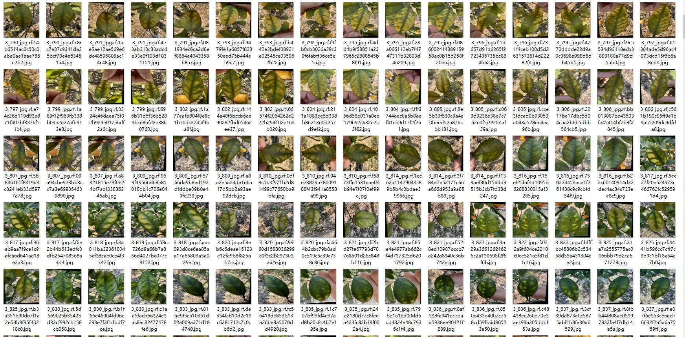
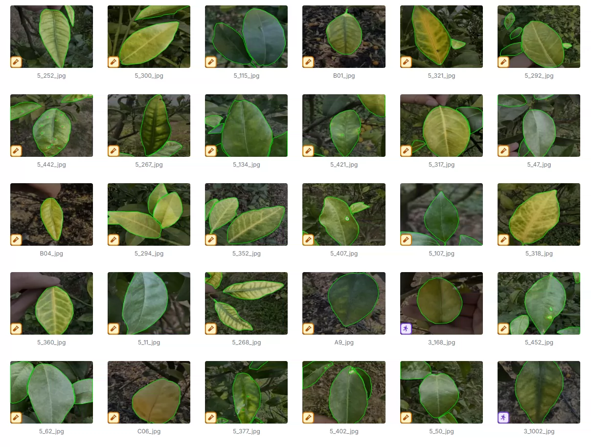
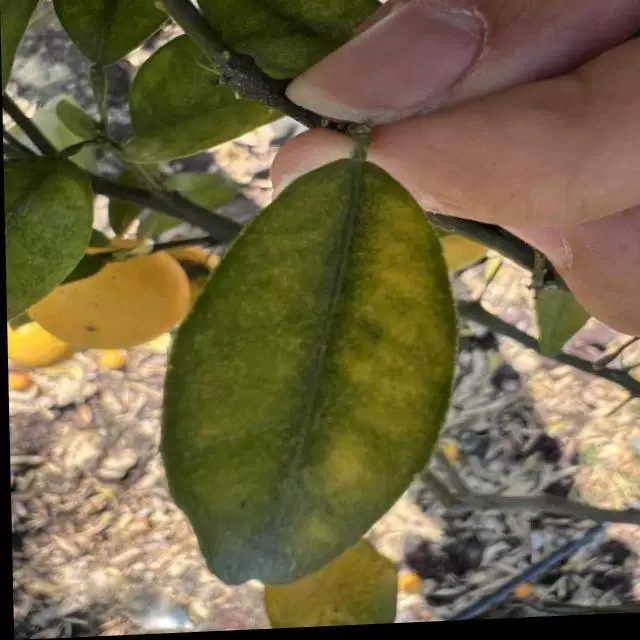
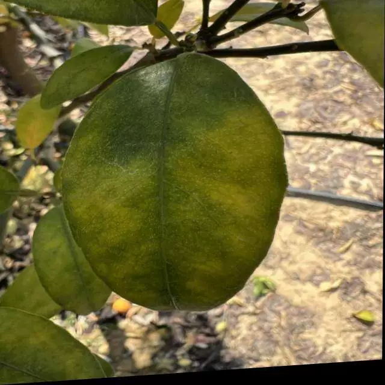
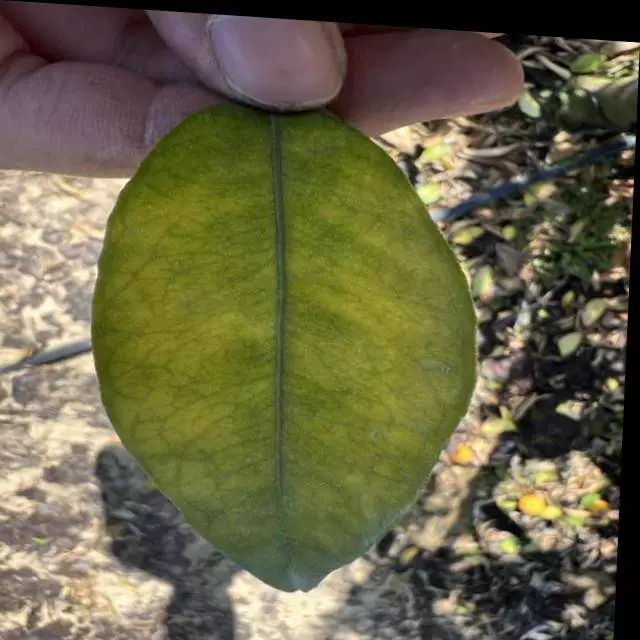
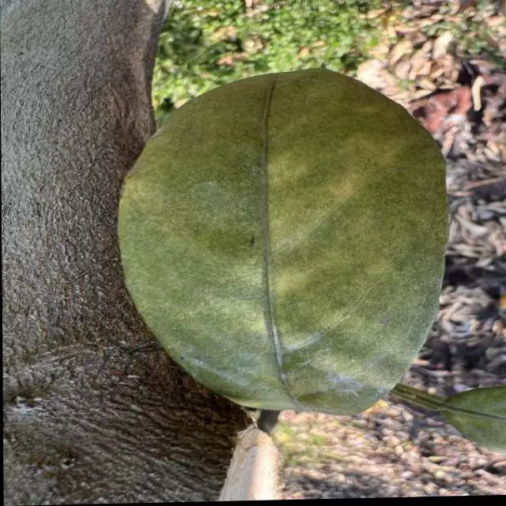

## Body

（Agricultural Product）Orange Leaf Disease Detection Dataset in YOLO format

Totally 2506 images, each labeled separately.
Divided into three categories: 'Orange_Huanglongbing', 'Orange_canker', 'Orange_healthy'
"Orange_Yellow Dragon Blight", "Orange_Ulcer", "Orange_Healthy"

Electronic virtual products are not returnable or exchangeable.

## Images

Here is a pay link on Stripe ( https://buy.stripe.com/3cs8yP7sY87d0vu9AB ). Please contact me lonlonago@foxmail.com after funding $89, and I will send you a complete data files , thank you!

